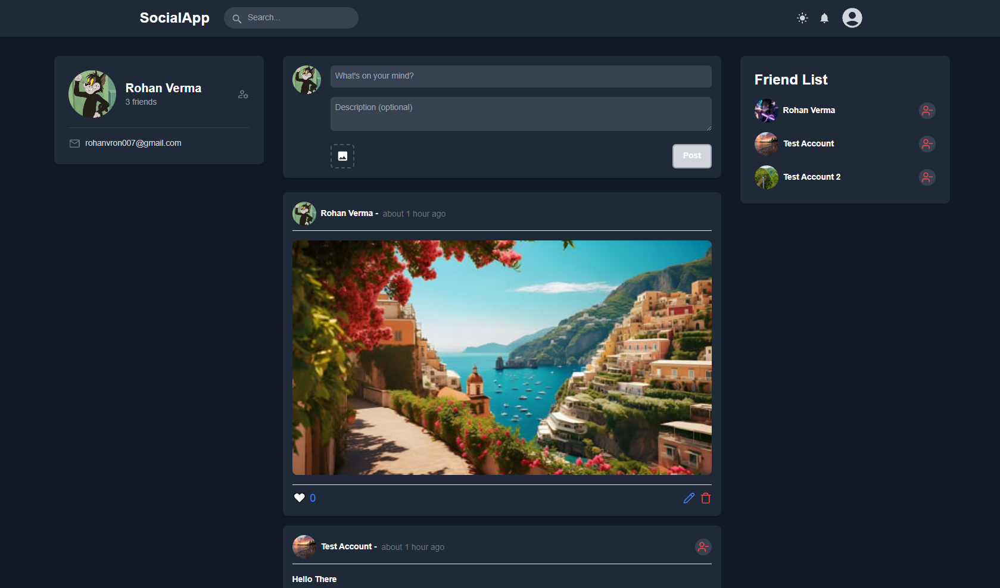
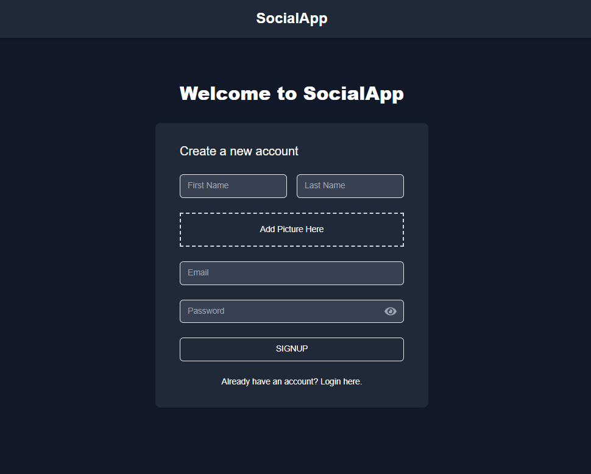
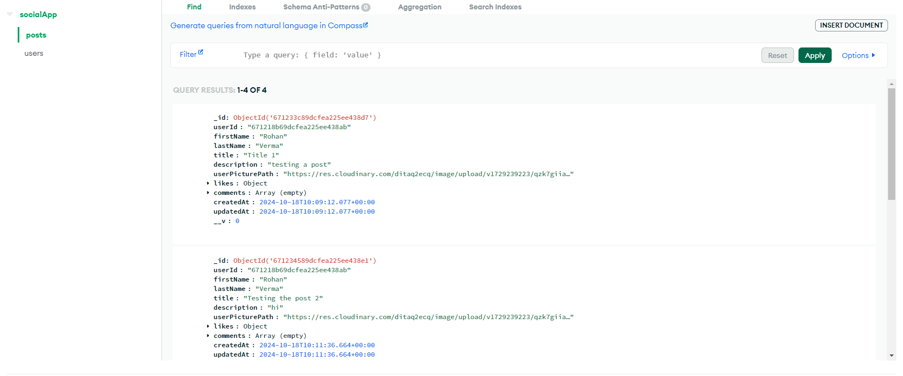
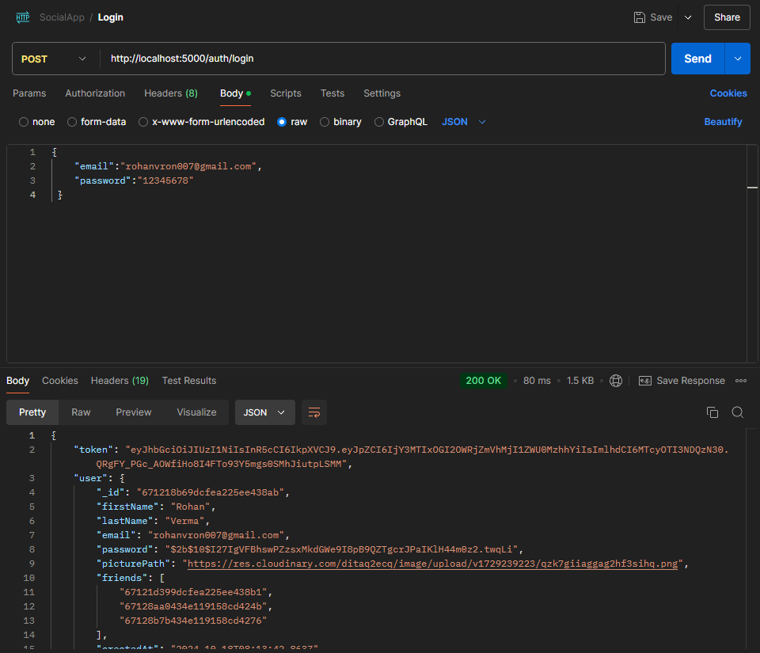

# SocialApp - Post Management System

SocialApp is a MERN-stack application that allows users to create, view, update, and delete posts. Users can manage their posts with images, titles, and descriptions in a seamless interface.

## Features

- User authentication with email and password
- Create, update, and delete posts
- View posts with images, titles, and descriptions
- Responsive design for various screen sizes

<p align="center"> 
 
</p>

## Technologies Used

### Frontend
- **React.js** for building user interfaces
- **Vite** as the build tool and development server
- **Redux** for state management
- **React Router** for navigation
- **React Icon** for icons
- **Material UI** for UI components
- **Tailwind CSS** for styling

<p align="center"> 
 
</p>

### Backend
- **Node.js** runtime
- **Express.js** web framework
- **MongoDB** for database storage
- **Mongoose** for object modeling
- **JSON Web Tokens (JWT)** for authentication
- **Bcrypt** for password hashing
- **Cors** for cross-origin resource sharing
- **Dotenv** for environment variable management
- **Multer** for handling file uploads
-**Cloudinary** for image storage

<p align="center"> 
 
</p>

## System Overview

SocialApp is a MERN-stack application combining a React frontend and a Node.js backend:

- The frontend utilizes React with Redux for state management, ensuring a smooth user experience with features like form validation and error handling.
- The backend leverages Express.js to handle API requests, while MongoDB stores data and implements JWT for secure authentication.
- The application allows users to manage posts effectively, ensuring a user-friendly interface for content creation and updates.

## API Endpoints

- **POST /api/auth/signup** - User registration
- **POST /api/auth/login** - User login
- **GET /api/posts** - Fetch all posts
- **POST /api/posts** - Create a new post
- **PUT /api/posts/:id** - Update an existing post
- **DELETE /api/posts/:id** - Delete a post

<p align="center"> 
 
</p>

## Setup Instructions

1. Clone the repository: 
   ```git clone https://github.com/rohanvron/SocialApp.git```

2. Install dependencies::
   ```cd frontend && npm install```
   ```cd ../backend && npm install```

3. Set up environment variables: Create a .env file in the backend directory with the following content:
    ```
    MONGODB_URI=your_mongodb_connection_string
        JWT_SECRET=your_jwt_secret
        PORT=5000
        CLOUDINARY_CLOUD_NAME=your_cloudinary_cloud_name
        CLOUDINARY_API_KEY=api_key
        CLOUDINARY_API_SECRET=secret_key
    ```

4. Start the backend server:
   ```cd backend && npm start```

5. Start the frontend development server:
    ```cd frontend && npm run dev```

6. Open your browser and navigate to http://localhost:5173 to view the application.


